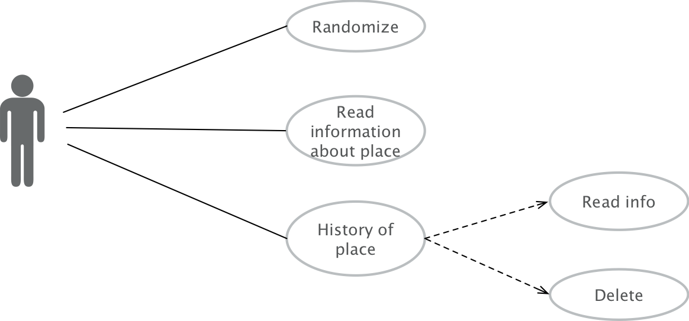
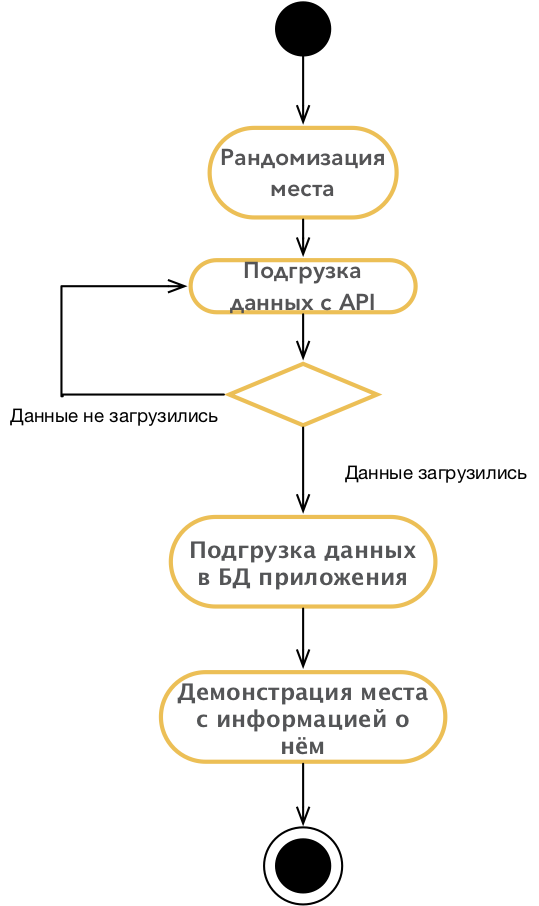
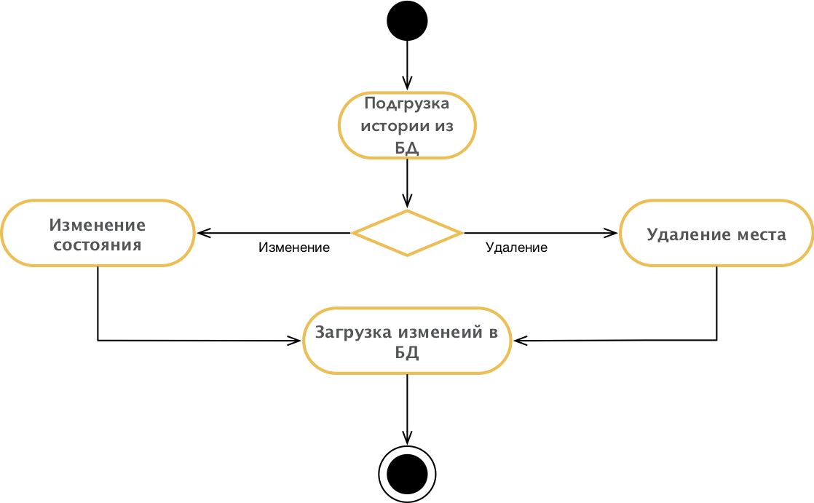
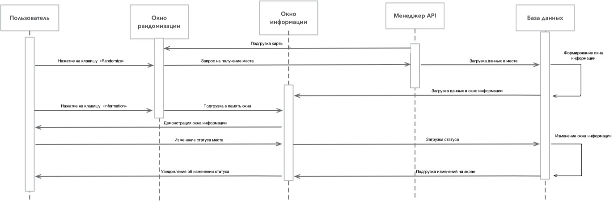

# UML Diagrams

## Содержание

1. [Диаграмма прецедентов](#precedent_diagramm)  
1.1 [Актёры](#actors)  
1.2 [Варианты использования](#variant_usages)  
1.2.1 [Рандомизация](#randomize)  
1.2.2 [Чтение подробной информации](#info)  
1.2.3 [Просмотр истории](#history)  
2. [Диаграммы активностей](#activity_diagramms)  
2.1 [Добавление рандомного места](#rand)  
2.2 [Работа с историей просмотра](#historyDio)  
3. [Диаграмма последовательности](#sequence_diagramm)  

<a name="precedent_diagramm"/>

## 1 Диаграмма прецедентов

<a name="actors"/>

### 1.1 Актёры
| Актёр | Описание | 
|:---|:---|
| User | Пользователь программы |

<a name="variant_usages"/>

### 1.2 Варианты использования

<a name="randomize"/>

#### 1.2.1 Поток событий для прецедента "Рандомизации" :
<strong>Описание:</strong> Вариант использования "Рандомизации" позволяет новому пользователю найти рандомное место для отдыха.  
<strong>Поток событий:</strong>  
1. Пользователь нажимает клавишу "Randomize" на главной панеле.
2. Приложение случайным образом находит место для отдыха.
3. Приложение при помощи API находит фотографии, краткое описание и стоимость белетов до этого места и загружает их в базу данных приложения.
6. Конец.

<a name="info"/>

#### 1.2.2 Поток событий для прецедента "Чтение подробной информации" :
<strong>Описание:</strong> Вариант использования "Чтение подробной информации" позволяет пользователю прочесть информацию о месте.  
<strong>Поток событий:</strong>  
1. После рандомизации система предлагает пользователю прочесть информацию о месте. 
2. При согласии приложение переносит пользователя на окно информации о месте.
3. Приложение подгружает данные из бызы данных, тем саым формерует окно.
4. После просмотра информации пользователю предлагается оценить это место.
5. Данные об оценки сохраняются в базе данных, для дальнейшей демонстрации в истории просмотра.
6. Конец.

<a name="history"/>

#### 1.2.3 Поток событий для прецедента "Просмотр истории" :
<strong>Описание:</strong> Вариант использования "Просмотр истории" позволяет пользователю вернуться к понравившимся местам.  
<strong>Поток событий:</strong>  
1. Вход пользователя в раздел история.
2. Подгрузка списка истории. 
3. Удаление происходит при помощи свайпа и нажатия.
4. Переоцека места происходит при помощи нажатия на элемент списка перехода в режим информации и повторной оценки.
5. Конец.
## 2 Диаграммы активностей

<a name="rand"/>

### 2.1 Добавление рандомного места
Пользователь заполняет все необходимые поля. Одновременно с этим система их валидирует и в случае ошибки выводит соответствующее сообщение. Если валидация прошла успешно, то на номер телефона послыается код подтверждения, который необходимо заполнить для успешной регистраци.
Если он не пришёл, пользователь может запросить его снова.  В случае успеха пользователь перенаправляется на главную страницу.

<a name="historyDio"/>

### 2.2 Работа с историей просмотра
Пользователь заполняет все необходимые поля. Система проверяет на наличие такого пользователя в системе, если такого нету, то выводит соответсвующее сообщение. В случае успеха пользователь перенаправляется на главную страницу.

## 3 Диаграмма последовательности
Диаграмма последовательности основных вариантов использования представлена ниже:

<a name="sost_diagramm"/>

