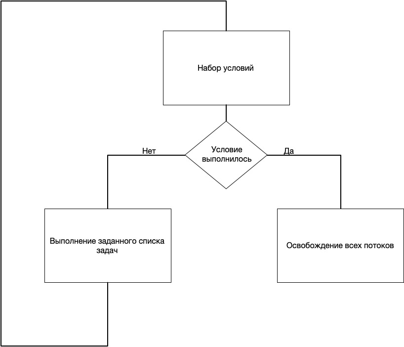
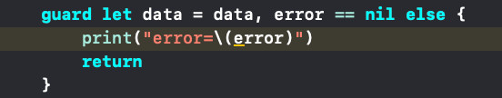
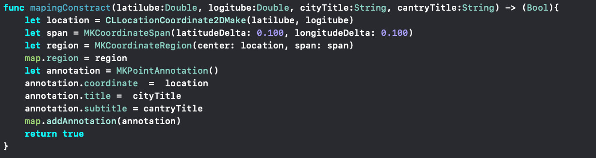

# Pattern
В данном проекте я использовальзуются патерны проектирования. Некоторые из встроены в сам язык Swift, некоторые реализованны собственноручно. Ниже приведены примеры с объяснениями некоторых из них:

### Guard

Данный патерн незаменимм в языке Swift при работе с удалёнными серверами и получением для них информации. Так как он блокирует потоки работающие с классом, что помогает избежать ошибок и исключительных ситуаций при отсутствии данных с сервера во время ожидания. В моём примере он используется с двумя условиями, но может применятся также и с одним условием.

Принцип рабты:

Пример в коде:

### Bilder 

Данный патерн является одним из самых распространённых. Он состовляет из простых блоков один общий более сложный. В языке Swift данный паттерн применяется очень часто, так как многие функции просят данные в определённой структуре, которая в свою очередь состоит из нескольких долее простых структур или ппеременных. И для запуска определённых функция для них нужно создать определённую структуру данных, как показано в ппримере ниже. В нем показано как я сначала инициализирую точку на карте, далее создаю её из простых переменных, присваивая определённым длокам структуры из переменные таккие как: кординаты(состоящие из двух Double), название места и более расширенное её название(состоящие из двух String), и отдаление от крты (состоящие из двух Double). Посте чего вызывается функция которая конструирует объект на карте.

Пример в коде: 

### Фасад

Данный структурный патерн используется для предоставления простого интерфейса к сложной системе классов. Основная задача для фасада это упростить использование сложных функций в головной функции интерфейса, урезая не нужные фунции. Данный структурный патерн идеально подходит для работы на языке Swift. Ибо он позволяет оменьшить нагрузку на класс интерфейса, и переложить его на класс который предоставляет все нужные данные по запросу. 

## Замечания
* Отсутствует указанный функционал в требуемые сроки
* Отсутствует инструкция к запуску приложения
