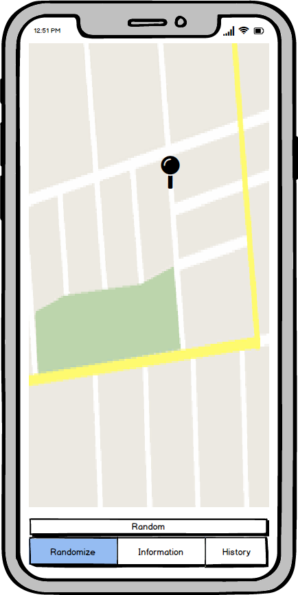
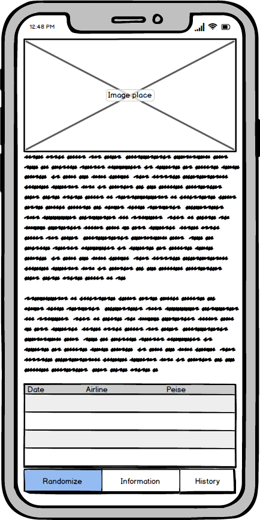
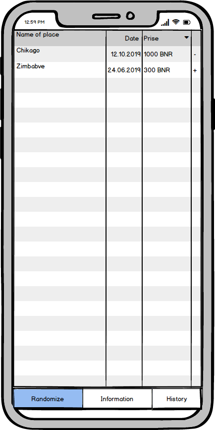

# Software Requirements Specification

## Content
1. [Introduction](#1)  
  1.1. [Purpose](#1.1)  
  1.2. [Document conventions](#1.2)  
  1.3. [Project scope](#1.3)  
  1.4. [User Requirements](#1.4)  
2. [User Requirements](#2)  
  2.1. [Software Interfaces](#2.1)  
  2.2. [User Interfaces](#2.2)  
  2.3. [User Characteristics](#2.3)  
  2.4. [Assumptions and Dependencies](#2.4)  
3. [System Requirements](#3)  
  3.1 [Functional Requirements](#3.1)  
  3.2 [Non-Functional Requierements](#3.2)  

<a name="1"/>

## 1. Introduction

<a name="1.1"/>

### 1.1 Purpose
The purpose of travel randomizer help people to make a choice cantries for travel.

<a name="1.2"/>

### 1.2 Document conventions
| Term | Definition |
|:---|:---|
| Scene | The SceneKit scene to be displayed in view. |
| Undo | Function is executed to reverse the last action. |
| Reset | Function is executed to reverse all user actions. |
| Device | Mobile phone with certain characteristics. |

<a name="1.3"/>

### 1.3 Project scope
The "Travel randomizer for iOS" allows users to diversify her travel . The user can choose a random place to travel, see same photo about this place  and find out the price of ticets.

<a name="1.4"/>

### 1.4 References
* [Human Interface Guidelines](https://developer.apple.com/design/human-interface-guidelines/ios/overview/themes/)
* [Apple Developer Documentation](https://developer.apple.com/documentation)

<a name="2"/>

## 2. User Requirements

<a name="2.1"/>

### 2.1 Software Interfaces
Swift language and integrated development environment Xcode will be used to develop the application.

| Framework | Discription |
|:---|:---|
| Foundation | The Foundation framework provides a base layer of functionality for apps and frameworks, including data storage and persistence, text processing, date and time calculations, sorting and filtering, and networking. |
| UIKit | Used to construct and manage a graphical, event-driven user interface. |
|DataCore| Data base for ios.|
| SceneKit | Create 3D games and add 3D content to apps using high-level scene descriptions. Easily add animations, physics simulation, particle effects, and realistic physically based rendering. SceneKit combines a high-performance rendering engine with a descriptive API for import. |

<a name="2.2"/>

### 2.2 User Interfaces
Randomize screen have map and button for randomize place

Information about place.

History of place for travel.

<a name="2.3"/>

### 2.3 User Characteristics
Children and youth who are interested in treveling. And people of other age categories who are interested travel.

<a name="2.4"/>

### 2.4 Assumptions and Dependencies
1. User permission to using internet.

<a name="3"/>

## 3. System Requirements

<a name="3.1"/>

### 3.1 Functional Requirements
The user is provided with the following options:

| Function | Requirments |
|:---|:---|
| Review information of place | Show same information and photo about ramdom plase |
| Review prise | Show prise of ticket |
<a name="3.2"/>

### 3.2 Non-Functional Requirements
1. IOS devise.
2. Internet connection.
